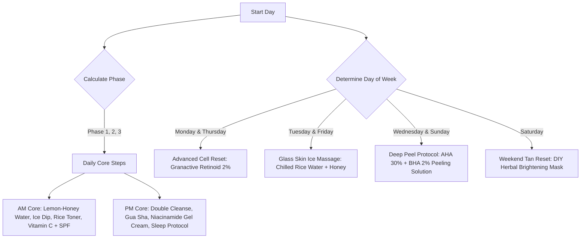

# 🌌 100-Day Personal Upgrade Engine (PUE)

An interactive, responsive, and premium web application designed to act as a system-level tracking dashboard for a **100-Day Face & Skin Personal Upgrade Protocol**. Built on systemic biohacking principles, this dashboard guides the user through three core phases, manages product procurement, logs daily notes, and syncs progress locally via Excel or to the cloud via Google Sheets.

---

## 🚀 Key Features

*   **Progress Dashboard Grid**: A visual representation of the 100-day journey. Cells automatically update their states (Completed, Current, Future/Locked) and color-code their respective phases.
*   **Daily Routine Tracker**: A contextual checklist that adapts dynamically based on the active day, phase, and day of the week (e.g., executing Retinoid treatment only on Mondays and Thursdays, and peeling protocols on Wednesdays and Sundays).
*   **Educational "Why" Pane**: Clicking on any routine step displays the specific bio-chemical mechanism (the scientific reason why it works) and the recommended product details.
*   **Procurement Shopping Checklist**: A categorized registry (Actives, Kitchen Naturals, Tools, and Lifestyle items) to trace and update items purchased or owned.
*   **Local Excel Sync (Offline-First)**: Complete export and import of tracking logs, configuration parameters, and inventory checklists to `.xlsx` files powered by [SheetJS (XLSX)](https://sheetjs.com/).
*   **Google Sheets Cloud Sync**: A serverless, cross-device database connection enabled by a custom Google Apps Script proxy. It stores the application state as a JSON DB while building human-readable spreadsheet tabs automatically.
*   **Premium Dark UI**: Built with glassmorphism overlays, custom scrollbars, neon accent glows, and smooth transitions using responsive flex/grid layouts.

---

## 📂 Project Architecture

The project consists of three core frontend files, keeping it light, offline-capable, and simple to deploy (e.g., via GitHub Pages):

```bash
Glow-up/
├── index.html     # Semantic structure, tab layout, dynamic modal boxes, and CDN resources
├── styles.css     # Styling tokens, responsive grid layouts, animations, and typography
├── app.js         # Core engine: State management, business logic, templates, and sync mechanisms
└── README.md      # Project documentation (this file)
```

---

## 🧪 The 100-Day Biohacking Program Phases

The protocol is divided into three consecutive phases to prevent skin shock, establish tolerance, and maximize structural muscle alignment:

| Phase | Days | Title | Focus & Description |
| :--- | :--- | :--- | :--- |
| **Phase 1** | `1 - 15` | **Foundation** | Acquisition, Patch Testing & Skin Acclimation. Focuses on establishing AM/PM cleansing baselines, initiating mild cell turnover, and ensuring product tolerability. |
| **Phase 2** | `16 - 50` | **Sharpening** | Lymphatic Drainage & Muscle Engagement. Targets water retention/puffiness with Gua Sha, activates masseter hypertrophy using sugar-free gum, and lifts stubborn surface tans. |
| **Phase 3** | `51 - 100` | **Refinement** | Systemic Brightening & Lock-in. Adds internal detox components (honey-lemon, green tea), safe high-acid peeling, and structural jawline maintenance. |

---

## ⏰ Daily Routine & Schedule Reference

The engine dynamically filters routines depending on the day of the week to allow active skins (AHA/BHA, Retinoids) to rest, preventing post-inflammatory hyperpigmentation.



### Routine Steps Details

1.  **Lemon + Honey + Warm Water** *(Daily AM - 6:30 AM)*
    *   *Purpose*: Alkalizes the body and stimulates liver cleansing to remove internal sallow tones.
2.  **Ice Dip + Rice Water + Gulab Jal Toner** *(Daily AM - 7:00 AM)*
    *   *Purpose*: Drains overnight lymphatic fluid, depuffs cheeks, and plumps cells with fermented inositol.
3.  **Vitamin C Serum + Sunscreen** *(Daily AM - Post-Bath / 7:20 AM)*
    *   *Purpose*: Melanin synthesis inhibitor (brightens and fades tan) while protecting collagen structure from UV degradation.
4.  **Mid-day Sunscreen + Chewing Gum + Green Tea** *(Daily Mid-day - 12:00 PM)*
    *   *Purpose*: SPF reapplication, 20 mins chewing gum for masseter muscle hypertrophy, and EGCG antioxidants to block collagen glycation.
5.  **Reapply Sunscreen** *(Daily PM - 3:00 PM)*
    *   *Purpose*: Blocks late afternoon UV rays that trigger melanin synthesis.
6.  **Double Cleanse** *(Daily PM - Evening)*
    *   *Purpose*: Uses a 2% Salicylic Acid + LHA wash to clear deep-seated sebum and prevent blackheads.
7.  **Advanced Cell Reset** *(Mon & Thu PM - Night)*
    *   *Purpose*: Employs Granactive Retinoid 2% to accelerate skin cell turnover, pushing out damaged hyperpigmentation layers.
8.  **Glass Skin Ice Massage** *(Tue & Fri PM - Night)*
    *   *Purpose*: Vasoconstrictive cooling workout to soothe Retinoid-stressed skin and tighten pores.
9.  **Deep Peel Protocol** *(Wed & Sun PM - Night - Max 5 mins)*
    *   *Purpose*: 30% AHA + 2% BHA chemical exfoliant to dissolve dead cell bonds and lift surface tans.
10. **Weekend Tan Reset** *(Sat PM - Night)*
    *   *Purpose*: DIY mask containing Multani Mitti, Papaya, Turmeric, Honey, and Saffron. Papain digests dead proteins, and Saffron inhibits tyrosinase.
11. **Manual Gua Sha Sculpt** *(Daily PM - Night)*
    *   *Purpose*: Mechanically drains facial lymph nodes using a stainless steel tool and moisturizer.
12. **Skin Seal** *(Daily PM - Night)*
    *   *Purpose*: Locks in active products and hydrates with Niacinamide and Rice Water Gel.
13. **Sleep Protocol** *(Daily PM - Night)*
    *   *Purpose*: 7-8 hours of sleep and high hydration levels to optimize overnight healing.

---

## 🎨 Aesthetics & Design Tokens

The application leverages a premium design language optimized for high visual appeal:

*   **Typography**: Headings styled with `Outfit` for a modern, tech-focused look; body text styled with `Plus Jakarta Sans` for clean, high-density reading.
*   **Colors**:
    *   Base Dark: `#08070d`
    *   Card Surface: `rgba(18, 15, 30, 0.65)` with a `16px` backdrop filter blur
    *   Neon Accents: Cyan (`#00f2fe`) and Purple (`#a855f7`) gradients
    *   Success Indicators: Emerald Green (`#10b981`)
*   **Visual Effects**: Hover states feature smooth transitions (`all 0.3s cubic-bezier(...)`), slight elastic scales, and floating neon drop shadows. Custom scrollbars are styled with a purple accent thumb.

---

## 🛜 Synchronization Systems

The PUE supports two methods of data backup and multi-device persistence:

### 1. Offline-First Excel Integration
*   **Export Logs**: Generates a multi-sheet workbook containing:
    1.  `Daily Tracking Logs`: Row-by-row completion status and custom day-notes.
    2.  `Inventory Status`: Status of skincare products, kitchen staples, and tools.
    3.  `App Configuration`: Active start date and current Google Web App URL settings.
*   **Get Template**: Generates an empty, well-formatted spreadsheet with days and routines mapped out, ready to be filled out in offline editors like Microsoft Excel, Google Sheets, or Apple Numbers.
*   **Import Sheet**: Drag-and-drop parser that reads configuration values, parses logs/completion percentages, checks items off your inventory, and repopulates local storage instantly.

### 2. Google Sheets Cloud Sync
A cloud synchronization system using Google Apps Script. 

```
┌─────────────────┐       GET (Read raw JSON DB)       ┌──────────────────────┐
│                 │ <────────────────────────────────> │                      │
│   Glow-up App   │                                    │  Google Apps Script  │
│   (HTML/JS)     │                                    │   (Web App Proxy)    │
│                 │ <────────────────────────────────> │                      │
└─────────────────┘      POST (Update logs & tables)   └──────────┬───────────┘
                                                                  │
                                                                  ▼
                                                      ┌──────────────────────┐
                                                      │  Google Spreadsheet  │
                                                      │ ├── DB_STORE (JSON)  │
                                                      │ ├── Daily Logs (Tab) │
                                                      │ └── Inventory (Tab)  │
                                                      └──────────────────────┘
```

> [!NOTE]
> The Apps Script handles database reads and writes in cell `A1` of a hidden `DB_STORE` sheet, while simultaneously expanding that raw data into clean, formatted spreadsheets (`Daily Logs` & `Inventory Checklist`) for easier spreadsheet reporting.

#### Setup Guide for Google Sheets Cloud Sync:
1.  Create a new Google Sheet named **100-Day Upgrade Log**.
2.  Click **Extensions > Apps Script** in the top menu.
3.  Replace the default code in the editor with the script code shown in the **Cloud & Excel Sync** tab of the dashboard (or copied below).
4.  Click the **Deploy** button > **New Deployment**.
5.  Select **Web App** as the deployment type:
    *   *Execute as*: **Me**
    *   *Who has access*: **Anyone**
6.  Click **Deploy**, authorize permissions, copy the generated **Web App URL**, and paste it into the script URL input in your Glow-up Dashboard.

#### Google Apps Script Source Code:
```javascript
/**
 * Google Apps Script Proxy for 100-Day Upgrade Dashboard
 * Allows reading and writing tracker logs to a single cell or formatted sheets.
 */
function doGet(e) {
  var doc = SpreadsheetApp.getActiveSpreadsheet();
  var dbSheet = doc.getSheetByName("DB_STORE") || doc.insertSheet("DB_STORE");
  
  // Read raw database json from A1
  var rawJson = dbSheet.getRange(1, 1).getValue();
  
  return ContentService.createTextOutput(rawJson || "{}")
    .setMimeType(ContentService.MimeType.JSON);
}

function doPost(e) {
  var doc = SpreadsheetApp.getActiveSpreadsheet();
  
  // CORS options preflight handler fallback
  if (!e.postData || !e.postData.contents) {
    return ContentService.createTextOutput(JSON.stringify({ status: "error", message: "No data received" }))
      .setMimeType(ContentService.MimeType.JSON);
  }
  
  var payload = JSON.parse(e.postData.contents);
  var appState = payload.state;
  
  // 1. Store Raw DB JSON in Cell A1
  var dbSheet = doc.getSheetByName("DB_STORE") || doc.insertSheet("DB_STORE");
  dbSheet.getRange(1, 1).setValue(JSON.stringify(appState));
  
  // 2. Expand human-readable Logs row-by-row
  var logSheet = doc.getSheetByName("Daily Logs") || doc.insertSheet("Daily Logs");
  logSheet.clear();
  logSheet.appendRow(["Day", "Date", "Completed Steps Count", "Steps Checked", "Notes", "Completed Status"]);
  
  // Sort logs by day number
  var keys = Object.keys(appState.logs).sort(function(a, b) {
    return parseInt(a.split('_')[1]) - parseInt(b.split('_')[1]);
  });
  
  keys.forEach(function(key) {
    var dayIndex = parseInt(key.split('_')[1]);
    var dayNum = dayIndex + 1;
    var log = appState.logs[key];
    
    // Compute date if start date exists
    var dateStr = "N/A";
    if (appState.startDate) {
      var d = new Date(appState.startDate);
      d.setDate(d.getDate() + dayIndex);
      dateStr = d.toLocaleDateString();
    }
    
    logSheet.appendRow([
      "Day " + dayNum,
      dateStr,
      log.completedSteps.length,
      log.completedSteps.join(", "),
      log.notes,
      log.completed ? "COMPLETED" : "IN_PROGRESS"
    ]);
  });
  
  // 3. Expand human-readable Inventory checklist
  var invSheet = doc.getSheetByName("Inventory Checklist") || doc.insertSheet("Inventory Checklist");
  invSheet.clear();
  invSheet.appendRow(["Item ID", "Purchased Status"]);
  appState.inventory.forEach(function(item) {
    invSheet.appendRow([item.id, item.purchased ? "OWNED / BOUGHT" : "PENDING"]);
  });
  
  return ContentService.createTextOutput(JSON.stringify({ status: "success", timestamp: new Date().getTime() }))
    .setMimeType(ContentService.MimeType.JSON);
}
```

---

## 🛠️ Local Development & Running

Since this is a lightweight static site, you don't need any complex bundler to run it locally. Simply run a local web server in the directory:

```bash
# Python 3
python3 -m http.server 8080

# Node.js (Install http-server globally first: npm install -g http-server)
npx http-server -p 8080
```

Then visit [http://localhost:8080](http://localhost:8080) in your web browser.

---

## 🛡️ License & Attributions
*   **Icons**: [FontAwesome v6 Free CDN](https://fontawesome.com/)
*   **Fonts**: [Google Fonts (Outfit & Plus Jakarta Sans)](https://fonts.google.com/)
*   **Parsing Library**: [SheetJS (xlsx.full.min.js)](https://github.com/SheetJS/sheetjs)
*   **Concept**: Biohacking skin & jawline metrics optimized for South Asian/melanin-rich skin tones.
